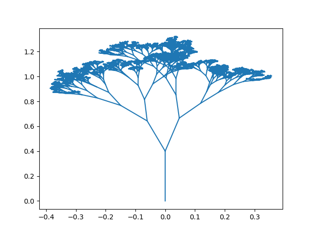
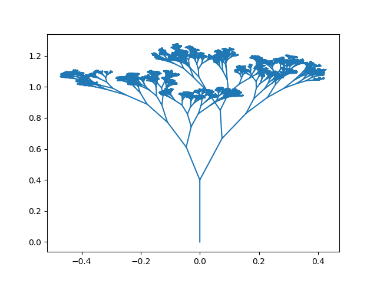
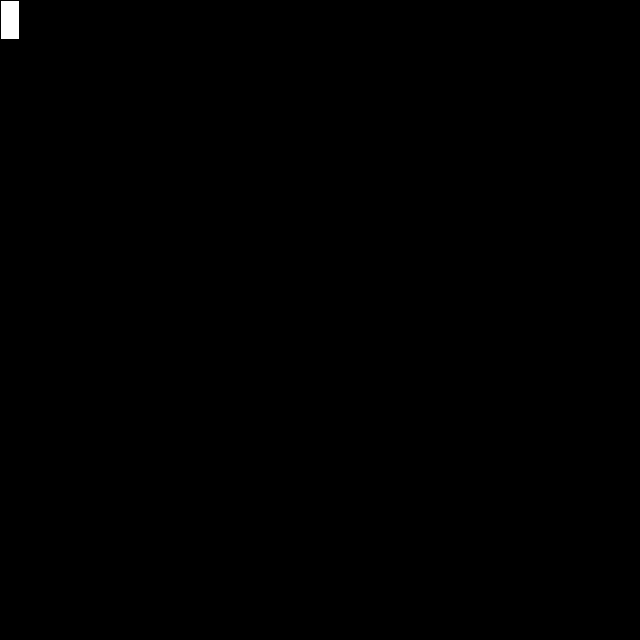
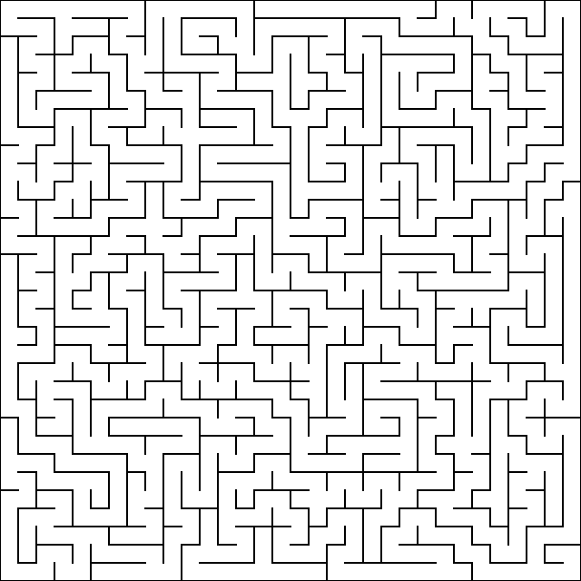

# Drawings and animations using Python

## Tree
Examples of randomly generated trees of depth `14`, max deviation angle `pi/8` and child branch length ratio between `[0.5, 0.8]`:

## Animated tree drawing

## Random Maze Generation
The algorithm used to generate the maze is randomized DFS. We start with a grid having walls everywhere between any two cells. We use DFS to open walls by randomly choosing a neighbour.

## Maze Solving
Use DFS to solve the generated maze.

